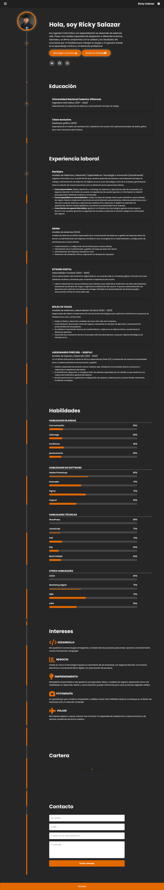

# Portafolio Personal de Ricky Salazar

¡Bienvenido a mi portafolio personal! Este proyecto fue construido desde cero con HTML, CSS y JavaScript puro.

 

## ✨ [Ver Demo en Vivo](https://rickymichael.github.io/rickysalazar/) 

## 🚀 Características

*   **Diseño Limpio y Moderno:** Interfaz minimalista con una línea de tiempo interactiva.
*   **Modo Claro y Oscuro:** Tema adaptable a las preferencias del usuario.
*   **Totalmente Responsivo:** Adaptado para móviles, tabletas y escritorio.
*   **Animaciones Suaves:** Uso de GSAP y AOS para una experiencia de usuario fluida.
*   **Carrusel de Proyectos:** Implementado con Swiper.js.

## 🛠️ Tecnologías Utilizadas

*   HTML5 (Semántico)
*   CSS3 (Variables, Flexbox, Grid)
*   JavaScript (ES6+)
*   **Librerías:** GSAP (ScrollTrigger), Swiper.js, AOS (Animate on Scroll).

## 📄 Licencia

Este proyecto está bajo la Licencia MIT.
